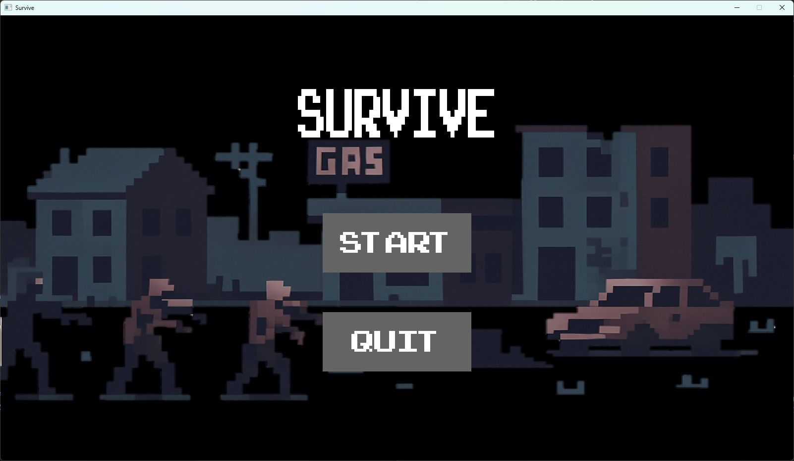
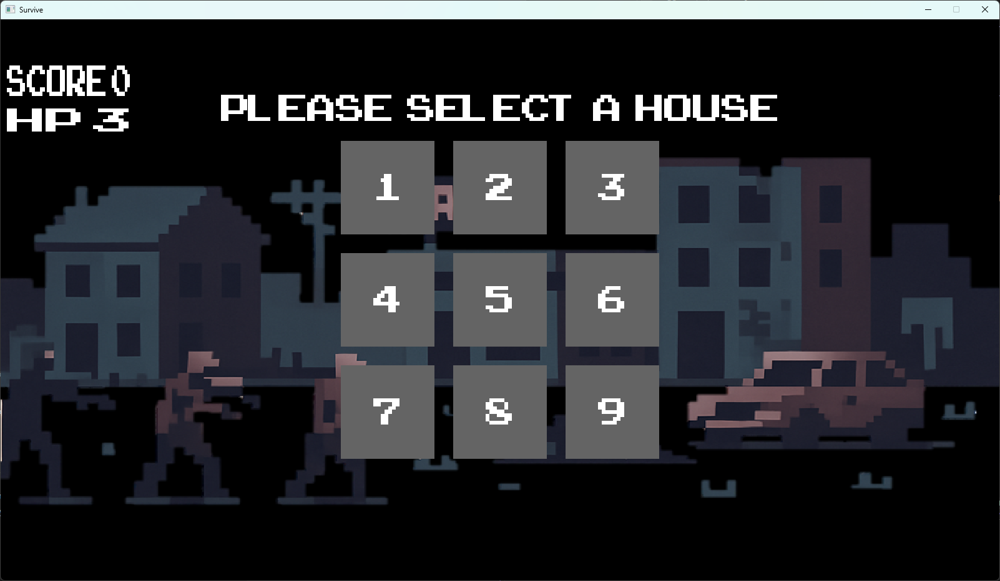
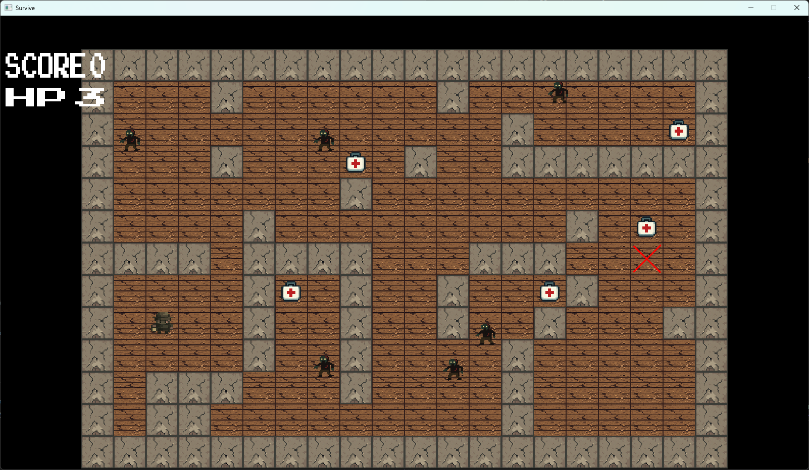
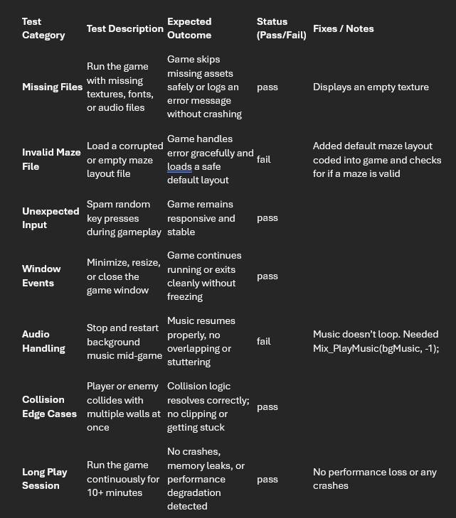

# Zombie Apocalypse Maze Game

## Video Demonstration

## Gameplay Description
The main gameplay of this game is of the player entering mazes with enemies and collectables to get as high of a score as possible.
The main game loop consists of the player choosing a 'house' to enter then entering and navigating a maze to reach an exit getting as many collectables as possible while avoiding the enemies.

## Dependencies Used
The dependencies used were; SDL2-2.32.6 , SDL_ttf-2.24.0 , SDL2_image-2.8.8 , SDL_mixer-2.81

## Use of AI
For the use of AI the main utility i had of it was to give some basic examples of code using SDL2 to learn how to use and program with it. 
I also used it to understand and fix any syntax errors that i couldn't figure out on my own mainly when the SDL2 window froze as no error was given. As i have never used SDL2 this was very helpful to me to accelerate the start of development.
As well as some trickier logic issues that i tried to solve independantly but failed. I also used AI to generate the images for the game using https://pixelartgenerator.app/ for this. 
I decided on this approach to save time to allow me to focus more on the programming design and implementation.
I also used it for planning to allow me to use my time effectively. I asked it to split the work i needed to do into working days so i could keep on track.
I also used AI to generate the maze layouts as i needed a lot of them and making them by hand would take a large amount of time. I did have to go through and clean up some of them as they were not possible to complete or didn't have enough challenge.

## Game Programming Patterns Used
The first game programming pattern i used was a design pattern of using states. I decided to use states as i could make one parent class and the Game object could save and use any state the game needed. I ended up needing 4 states in total of: menuState, worldMapState, mazeState and winLossState.
I decided to use this pattern as it mad keeping each element of the game seperate so it was easier to test and develop. Using this i was able to develop each state individually and be confident that they didn't interfere with each other.
The next programming pattern i used was the game loop and update method. This was useful as using an update method allowed me to update all the objects in the game in a single function making it obvious if i missed any. 
It also let me seperate different objects update logic and calling it in its owners class e.g. having a player update method for the movement and calling it in the mazeState update.
I also used a singleton as the Game object to manage the games state and the rendering of the game. This was useful as it allowed one point where rendering occured so i could easily spot any errors occuring and know where they were caused.

## Game Mechanics and Implementation
The main game mechanic is the player movement which is free movement for the player using WASD inside the bounds of the maze. To implement this i used keyboard input and wall collision checks to allow the player to move and SDL_Rect to act as the player and the collision box for it.
The second most important mechanic i implemented was the enemies patrolling. To do this they are set a start position and randomly select a direction to travel (e.g. horizontal or vertical) until they collide with a wall where the direction either reverses or changes which is also random. This makes them more unpredicatble for the player to avoid.
Also if they collide with a player they fail the maze and lose 1 life if all are lost they lose. To win they must complete 10 mazes.
Next i have resource collection which is done with a simple collision check between the player and the resource's collider. When it is collected the player's score increases and a sound is triggered.
Lastly, I have an audio system which plays background music as well as sound effects for collecting resources and clicking a UI button. I used SDL_mixer for looping music and adjusting the volume, and event based SFX.

## UML / Class Design Diagram

## Sample Screens

## Exception Handling and Test Cases

## Test Plan Summary
Startup - Game launches, builds and exits cleanly
UI - Menu and buttins respond to user input
Maze logic - Player/ enemy interactions behave correctly
Audio - Background music and effects trigger properly
Stability - No crashes or memory leaks during long gameplay

## Further Details

## Evaluation
